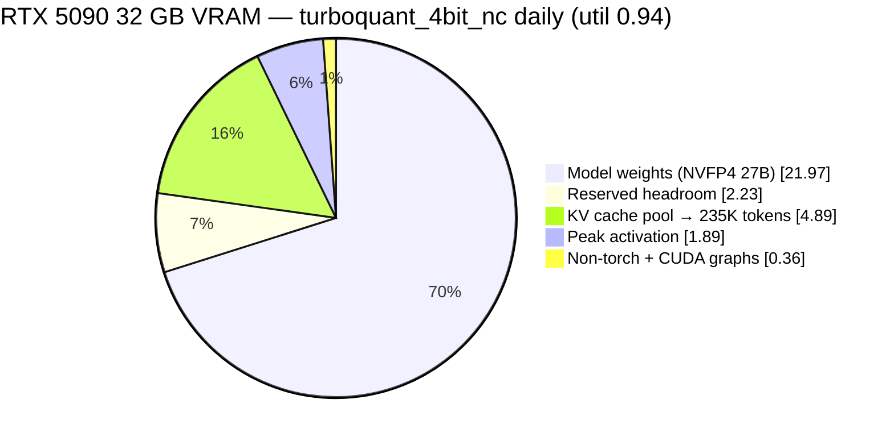

# Qwen3.6-27B on a single RTX 5090 — 235K KV pool, 4-bit TurboQuant cache, speculative decoding

Serving **Qwen3.6-27B with a 235K-token KV pool (200K usable context), MTP speculative decoding, and vision** on one 32 GB consumer GPU (RTX 5090, Blackwell `sm_120`).

## What you get

- **Qwen3.6-27B** (Unsloth NVFP4, 4-bit weights) served over an OpenAI-compatible endpoint.
- **235K-token KV pool → 200K usable context** via `turboquant_4bit_nc` KV cache (4-bit MSE Keys / 4-bit Values + norm-correction) — **+42% pool, +25% usable context** over the older `turboquant_k8v4` daily.
- **MTP speculative decoding** — draft head inside the weights, ~0 VRAM, mean acceptance length ~3.2.
- **Vision** — the model's image tower, on.
- All of it on **one 32 GB RTX 5090** (`sm_120`), memory-OC'd, 600 W.

```
                    max-len   decode c1   decode c4   decode c8   KV density
turboquant_4bit_nc  200K       133 t/s     432 t/s     435 t/s    ~48K tok/GiB  ← daily
turboquant_k8v4     160K       137 t/s     426 t/s     467 t/s    33.8K tok/GiB ← alt
fp8_e4m3            131K       130 t/s     482 t/s     478 t/s    26.0K tok/GiB ← alt: stock, deep-ctx batch
```
*Decode is @512 tg-throughput mean (pure decode), all with `--no-async-scheduling`. `turboquant_4bit_nc` trades a modest decode cost (−3% c1, −7% c8 short-ctx; up to −13% at deep single-stream — 4-bit-key dequant is Lloyd-Max codebook + per-GQA-head norm-correction; the inverse Hadamard is hoisted to one per-query GEMM, not per key vs k8v4's cheap FP8 cast) for **+42% KV pool**. `k8v4` (8-bit K / 4-bit V) is the decode-optimal middle ground; `fp8` on stock nightly is the most battle-tested path and wins deep-context high-concurrency batch — see [Benchmarks](#benchmarks). Context shown is usable `--max-model-len`, not raw KV-pool size: TurboQuant's continuation-prefill dequantizes the whole cached prefix to bf16 (~4 KB/token transient), so a single prompt far past the cap **OOM-kills the engine** — pool headroom buys concurrency, not longer prompts. See [CONFIG.md](docs/CONFIG.md). (fp8 wasn't re-run under `--no-async-scheduling`; its numbers are the earlier same-session baseline.)*

## Async scheduling must be disabled with TurboQuant 4-bit KV and MTP

> ⚠️ **`--no-async-scheduling` is the whole reason `turboquant_4bit_nc` is usable at all.** vLLM's async scheduler desyncs its request-ID→batch-row mapping under speculative decode ([vllm#42655](https://github.com/vllm-project/vllm/issues/42655)): MTP emits a multi-token *verify* batch every step, so even a **single** request spans multiple batch rows, and the async path maps them to the wrong KV slots → cache corruption. 4-bit keys are far more sensitive to that corruption than 8-bit — it showed up as a catastrophic **0/8** retrieval for `turboquant_4bit_nc` but only ~10% intermittent degradation for `k8v4`, which is exactly why we mis-rejected `4bit_nc` for months (see [the reversal](docs/HISTORY.md#status-turboquant_4bit_nc-is-the-daily-the-asyncspec-reversal)). With `--no-async-scheduling`, verified-genuine `4bit_nc` is **completely clean** (8/8 retrieval @9K/20K/40K; **90/90** under high-pressure concurrency). **Broad implication:** the widely-repeated "all custom 4-bit-KV kernels corrupt under concurrency" belief — which this repo's [patch stack](#whats-in-the-patch-stack) partly addressed — was very likely *this async×spec scheduler bug, not the kernels.* (We haven't retested whether the existing guard patches are still needed with async off; the #40914 out-param fix is still real either way.)

## Why it needs patches

This configuration **does not work on stock vLLM**, for two independent reasons.

**(1) TurboQuant KV + MTP produce garbage together on stock vLLM** — a known, unfixed upstream bug ([vllm#40880](https://github.com/vllm-project/vllm/issues/40880), tracked as unsupported in [#40069](https://github.com/vllm-project/vllm/issues/40069)). The open PR that claims to fix it ([#40914](https://github.com/vllm-project/vllm/pull/40914)) **does not work on Blackwell** — it has a bug of its own ([the full story](docs/HISTORY.md#the-bug-nobody-caught)). This repo's image carries #40914 plus the fixes that make it actually work on `sm_120`.

**(2) vLLM's async scheduler corrupts KV under speculative decode** — the async×spec desync above ([#42655](https://github.com/vllm-project/vllm/issues/42655)), fixed at the flag level with `--no-async-scheduling`.

Plus one quality graft: **[PR #44993](https://github.com/vllm-project/vllm/pull/44993)** fixes structured output silently returning empty content under a reasoning model (schema JSON leaking into `reasoning_content`). How the config was arrived at — including the "TurboQuant corrupts" and "4bit_nc destroys retrieval" misdiagnoses we later reversed — is in [docs/HISTORY.md](docs/HISTORY.md).

## Quick start

```bash
# 1a. pull the prebuilt image…
docker pull ghcr.io/adrienbrault/vllm-turboquant:2026-07-13

# 1b. …or build it yourself (~1 min — pure-Python patches, no CUDA recompile)
cd patches && docker build -t vllm-turboquant:patched .

# 2. serve
./scripts/serve.sh
```

The `:2026-07-13` tag is the TurboQuant patch base. The **structured-output graft ([#44993](https://github.com/vllm-project/vllm/pull/44993))** is a newer addition to the [patch stack](#whats-in-the-patch-stack) — build the image yourself to include it (it's two pure-Python files). It's ~28 GB; that's the vLLM base, [not the patches](#whats-in-the-patch-stack).

Then `http://localhost:8020/v1` speaks OpenAI. See [`docs/CONFIG.md`](docs/CONFIG.md) for every flag and why.

> **Want the most battle-tested path, or serving deep-context high-concurrency batches?** fp8 KV on stock nightly remains a documented alternative — see [the status note](docs/HISTORY.md#status-turboquant_4bit_nc-is-the-daily-the-asyncspec-reversal) and the [alternative fp8 config](docs/CONFIG.md#alternative-stock-nightly--fp8-kv). The `turboquant_k8v4` middle ground (decode-optimal, +21% pool over fp8) is also still documented. Everything from here down is the `turboquant_4bit_nc` path the daily runs.

## What's in the patch stack

| patch | what it does |
|---|---|
| [`vllm-only.diff`](patches/vllm-only.diff) | Upstream [PR #40914](https://github.com/vllm-project/vllm/pull/40914) (open, unmerged): routes K+1 spec-verify batches through the TurboQuant decode kernel instead of the continuation-prefill path, which was attending only to just-drafted tokens and ignoring cached KV. |
| [`fix_spec_output.py`](patches/fix_spec_output.py) | **The fix that makes #40914 actually work on Blackwell.** Honors the out-param contract ([details](docs/HISTORY.md#the-bug-nobody-caught)). Without this you get `!!!!!!!`. |
| [`tq_auto_fallback.py`](patches/tq_auto_fallback.py) | Second upstream gap: the MTP draft runner never inherits `cache_config.cache_dtype`, so TurboQuant layers on the draft path arrive with `"auto"` and crash. Falls back to `$VLLM_TQ_PRESET`. |
| [`fix_spec_guard.py`](patches/fix_spec_guard.py) | **Third fix — intermittent `!!!!` under concurrency.** #40914's routing guard (`query_start_loc.shape[0] == B + 1`) fails on CUDA-graph **captured** steps because qsl is padded to max batch size ([flagged by @rmarnold on the PR](https://github.com/vllm-project/vllm/pull/40914)) → silent fallback to the buggy path → stale output with **0% draft acceptance**, but only on padded concurrent batch shapes. Fix: `>=`. *Note: this predates the `--no-async-scheduling` discovery; we haven't retested whether it's still load-bearing with async off, so it stays in the stack.* |
| [PR #44993 graft](https://github.com/vllm-project/vllm/pull/44993) — `v1/structured_output/__init__.py`, `v1/core/sched/scheduler.py` | **Structured output that survives thinking.** With a reasoning model, `response_format` json_schema + thinking-on returned EMPTY `content` (the schema JSON leaked into `reasoning_content`). Root cause: `should_advance`'s delta window (`num_computed_tokens − num_output_placeholders`) skips `</think>` when MTP rejects drafts, so the grammar never re-engages. Open, approved; stacked on merged #44297. Needs the launch flag `--structured-outputs-config '{"backend":"xgrammar","reasoning_parser":"qwen3","enable_in_reasoning":false}'`. **Lifted tool-eval 85→89.** Two pure-Python files. |
| [`tq_splits.py`](patches/tq_splits.py) | Makes TurboQuant's fixed decode KV-split count runtime-tunable (`$VLLM_TQ_KV_SPLITS`). *Tested: leave it at the default 32 — lowering it hurts both single-stream and batched.* |

## Benchmarks

Hardware: RTX 5090 32 GB (`sm_120`, +4500 MHz mem OC, 600 W) + Ryzen 9 5900X + 64 GB RAM, Ubuntu 24.04.
Model: [`unsloth/Qwen3.6-27B-NVFP4`](https://huggingface.co/unsloth/Qwen3.6-27B-NVFP4) (4-bit weights) + MTP `ns=3` + vision.
Tool: [llama-benchy](https://github.com/eugr/llama-benchy) 0.3.8. `turboquant_4bit_nc` (daily) and `turboquant_k8v4`, identical invocation (`--pp 512 4096 --tg 128 --concurrency 1 2 4 8 --runs 3`), same box, same session, **both with `--no-async-scheduling`** (2026-07-15). Full detail in [bench/RESULTS.md](bench/RESULTS.md).

### Throughput — decode (tokens/s)

**Short context (`pp=512`, pure decode) — tg-throughput mean:**

| KV cache | c1 | c2 | c4 | c8 |
|---|---|---|---|---|
| turboquant_k8v4 | **137** | **250** | 426 | **467** |
| **turboquant_4bit_nc** (daily) | 133 | 211 | **432** | 435 |

`4bit_nc` costs **−3% c1, −7% c8** vs k8v4 (c2 is the noisiest point, −16%; c4 is parity). The 4-bit-key dequant — Lloyd-Max codebook + per-GQA-head norm-correction; the inverse Hadamard is hoisted to one per-query GEMM, not per key — is more ALU work than k8v4's cheap FP8-cast keys — that's the price of the denser pool.

**Deep context (`pp=4096`, prefill mixed in) — tg-throughput mean:**

| KV cache | c1 | c2 | c4 | c8 |
|---|---|---|---|---|
| turboquant_k8v4 | **145** | 179 | 230 | **216** |
| **turboquant_4bit_nc** (daily) | 126 | 179 | 230 | 214 |

Deep single-stream is `4bit_nc`'s worst case (**−13% c1@4096**), converging to **parity from c2 up**. Net: `4bit_nc` is a **pool-for-modest-decode trade** — you give ~3–13% decode to gain +42% pool (+25% usable context).

> **Accuracy note on older k8v4 numbers.** Earlier revisions of this repo quoted `turboquant_k8v4` at decode **c1 164 @512** from a standalone `k8v4-bench.json`. A fresh same-session re-measurement did **not** reproduce it — fresh k8v4 is **~137 c1 @512**. The tables above use the fresh same-session numbers; the 164 figure was an outlier and is retired.

**MTP:** mean acceptance length ~3.2 of `ns=3`. **Prefill (measured, 4bit_nc):** 5,271 t/s @512 c1, **10,571 t/s @4096 c1** (flat through c4 ~10.4K) — parity with k8v4. fp8's earlier same-session decode (`--pp 512`): c1 130 / c2 251 / c4 482 / c8 478; deep (`pp=4096`) it leads from c2 up — the one regime fp8 still wins is **deep context (≥4K) at high concurrency**.

**Net for the daily** (interactive coding = low concurrency, deep context): `4bit_nc` gives the biggest pool at a small single-stream decode cost, with retrieval and MTP acceptance equal to k8v4. `k8v4` is the pick if you want the last few percent of decode and don't need the extra 40K of context; fp8 (stock nightly) is the pick for deep-context high-concurrency batch serving.

### VRAM budget

Weights eat ~70% of the card; only ~5 GiB is left for KV — and 4-bit keys make that slice denser still, which is where the +42% pool comes from at roughly the **same** KV memory as k8v4:



`4bit_nc` holds **235K tokens in ~the same ~4.89 GiB** k8v4 uses for 165K — 4-bit Keys + 4-bit Values ≈ 4 bits/element (+ norm-correction scales) vs k8v4's ~6, so it's ~1.4× denser where it counts. Full breakdown (util 0.94, 31.34 GiB usable):

| component | turboquant_4bit_nc | turboquant_k8v4 | fp8_e4m3 |
|---|---|---|---|
| Model weights (NVFP4 27B) | 21.97 GiB | 21.97 GiB | 21.97 GiB |
| Peak activation | 1.89 GiB | 1.89 GiB | 1.89 GiB |
| Non-torch + CUDA graphs | ~0.36 GiB | ~0.36 GiB | ~0.36 GiB |
| **KV cache pool** | **~4.89 GiB → ~235,000 tok** | 4.89 GiB → 165,274 tok | 5.25 GiB → 136,477 tok |
| Reserved headroom | ~2.23 GiB | ~2.23 GiB | ~1.9 GiB |
| **KV density** | **~48K tok/GiB** | 33.8K tok/GiB | 26.0K tok/GiB |

*(`4bit_nc`'s per-component GiB split is derived from the profiled 235K pool at util 0.94 with the same weights/activation as k8v4 — the pool count is measured; the exact GiB sub-split is inferred, not independently re-profiled.)*

### Quality

| eval | score | notes |
|---|---|---|
| **Aider polyglot** (225 exercises, diff) | **72.3%** pass@2 | 97.3% well-formed edits — reliably emits machine-applicable diffs (measured on the TQ image; not re-run per-preset) |
| **Terminal-Bench 2.1** (8-task subset ×2) | **7/8** pass@2 | matches the fp8 baseline — the KV cache costs no measurable quality |
| **[tool-eval-bench](https://github.com/SeraphimSerapis/tool-eval-bench) v2.1.0** (84 scenarios, hardmode, 4 trials) | **89.0** /100 | `4bit_nc`, async-off, with the #44993 SO graft (which lifted it 85→89) — **parity with k8v4's 89**. Matched protocol vs [published](https://github.com/MiaAI-Lab/Unsloth-Qwen3.6-27B-UD-Q8_K_XL_vs_nvidia-Qwen3.6-27B-NVFP4_tools_eval) nvidia NVFP4 89 / Unsloth Q8 83 — details in [bench/RESULTS.md](bench/RESULTS.md) |

MTP mean acceptance length ~3.2 of `ns=3`. Needle-in-haystack retrieval, `turboquant_4bit_nc` **with `--no-async-scheduling`**: **8/8 @9K, 8/8 @20K, 8/8 @40K**, and **90/90** under high-pressure concurrency (3 rounds × 30 needles, 6 background loaders) — the exact test that was supposed to "kill all 4-bit-KV." Without `--no-async-scheduling` this same config scored 0/8 (see [history](docs/HISTORY.md#status-turboquant_4bit_nc-is-the-daily-the-asyncspec-reversal)).

## Config essentials

`./scripts/serve.sh` runs the daily. The load-bearing flags, all explained in [`docs/CONFIG.md`](docs/CONFIG.md):

- `--kv-cache-dtype turboquant_4bit_nc` + `-e VLLM_TQ_PRESET=turboquant_4bit_nc` (must match) — the 4-bit-K/4-bit-V+norm-correction cache; needs the patched image.
- **`--no-async-scheduling` — CRITICAL.** Without it, `4bit_nc` + MTP corrupts KV (0/8 retrieval); with it, clean. See the [callout above](#async-scheduling-must-be-disabled-with-turboquant-4-bit-kv-and-mtp).
- `--gpu-memory-utilization 0.94 --max-model-len 200000` — let vLLM profile the ~235K pool; don't hand-set `--kv-cache-memory`, don't hand-set `--block-size`.
- `--speculative-config '{"method":"qwen3_5_mtp","num_speculative_tokens":3}'` — MTP, `ns=3`.
- `--structured-outputs-config '{"backend":"xgrammar","reasoning_parser":"qwen3","enable_in_reasoning":false}'` — enables the reasoning gate the #44993 graft needs (structured output with thinking-on). Requires an adequate `max_tokens` budget — reasoning + JSON; too small a budget truncates mid-think and looks empty.
- `--default-chat-template-kwargs '{"preserve_thinking":true}'` — keep historical `<think>` blocks across turns. **Caveat:** the *client* must resend prior reasoning in the **`reasoning`** message field (NOT the deprecated `reasoning_content`, which vLLM ignores on input) for it to persist.
- `--mamba-cache-mode align --enable-prefix-caching --enable-chunked-prefill` — hybrid-model prefix caching.
- `--reasoning-parser qwen3 --enable-auto-tool-choice --tool-call-parser qwen3_xml` — `qwen3_xml` is correct; `hermes` silently drops tool calls.
- `--limit-mm-per-prompt '{"image":4,"video":0}'` — vision on (~60K tokens of context).

**Verify container identity after launch.** Confirm the startup log reports a **~235K-token KV pool**, not ~165K. A silent fallback to `turboquant_k8v4` (e.g. a preset/dtype mismatch, or the wrong image) reads as a perfectly healthy server at the *wrong* config — you get k8v4's smaller pool and never notice. The pool size in the log is the fastest tell.

Model: pass Unsloth's `unsloth/Qwen3.6-27B-NVFP4` with **no** `--quantization` flag (it's compressed-tensors, auto-detected). The box runs a **+4500 MHz memory-only OC** at 600 W — all throughput numbers assume it; see [docs/CONFIG.md#host-notes](docs/CONFIG.md#host-notes).

## Alternative: LMCache tiered KV cache for multi-agent coding

**Multi-agent coding lives and dies by cache retention, not single-stream throughput.** Eight coding agents sharing one endpoint re-send enormous, near-identical prefixes (system prompt, tool schemas, repo context, growing session history). vLLM's on-GPU prefix cache evicts them the moment the pool fills; a revisit then pays a full **5.8s re-prefill** on a 40K-token session. So we gave vLLM a tiered KV cache via [LMCache](https://github.com/LMCache/LMCache): a **24 GB pinned-RAM L1** + **150 GB SSD L2** that survives eviction *and* container restarts.

**It works, and it composes with MTP speculative decoding** — the combination the upstream trackers list as unsupported ([vLLM #39809](https://github.com/vllm-project/vllm/issues/39809), [#26201](https://github.com/vllm-project/vllm/issues/26201) "mamba prefix caching + spec decode: TODO", [LMCache #2845](https://github.com/LMCache/LMCache/issues/2845)). The composed profile decodes within **−3..−9%** of the plain MTP daily and turns a cold-session revisit from 5.8s into **sub-1.4s**:

| decode t/s | c1 | c2 | c4 | c8 |
|---|---|---|---|---|
| daily — MTP, no cache | 126 | 247 | 449 | **488** |
| MTP + LMCache — composed on vLLM 0.24 (no patch) | 118 | 224 | 421 | 450 |
| MTP + LMCache — nightly + [our format-10 patch](patches/README.md#lmcache-format-10-kernel-patch-separate-project) | 122 | 240 | 428 | **458** |

The tiered-hit ladder (40K-token sessions): on-GPU ≈ instant → **L1 RAM hit ~0.5s** → **L2 SSD hit ~2.7s** → **cold re-prefill 5.8s**. Composed revisit walls land **0.64–1.4s** across the tiers. 150 GB of L2 is **~2M tokens of session history that never re-prefills and persists across restarts** — a 10×40K working set (29 GB > the 24 GB L1) spills to SSD with **zero thrash**, all 32 post-warm lookups hit. Prefill holds up too — composed sweep (batched 3199): **9.1K @2K / 9.0K @8K / 8.2K @16K / 7.0K @32K / 5.5K @64K / 4.0K @115K** t/s, ≈−10% vs the daily's batched-8192 path at matched depth. Pool: 124K tokens composed (nightly + patch), 163K no-MTP.

- **LMCache (MTP, no vision)** is the recommended setup for **multi-agent coding** — the profile runs `image:0`, trading vision for cache retention that pays for itself the moment two agents share a prefix. It uses **fp8 KV**: LMCache's persistence tier only round-trips faithfully with fp8 (the TurboQuant attempt is a documented non-ship — [details](docs/LMCACHE.md#lmcache--k8v4-composes-but-the-persisted-tier-is-lossy--not-shipped); `4bit_nc`'s even-more-packed layout would be lossier still).
- **The `turboquant_4bit_nc` daily** stays the **vision-capable** pick for a single interactive user, where there's no shared prefix to retain and single-stream latency is what you feel — and it now carries the biggest KV pool of any config here.

**Serve it:** [`scripts/serve-lmcache.sh`](scripts/serve-lmcache.sh) (port 8030). Every flag, the failure that earned it, and the LMCache-specific gotchas (flashinfer JIT, `expandable_segments`, the worker reaper, L1 sizing, the format-10 kernel patch) are in [`docs/LMCACHE.md`](docs/LMCACHE.md).

## Gotchas that bite during setup

1. **`--no-async-scheduling` is mandatory for TurboQuant 4-bit KV + MTP.** With async scheduling on, MTP's multi-token verify batches desync the async request-ID→batch-row mapping ([#42655](https://github.com/vllm-project/vllm/issues/42655)) and corrupt KV — catastrophically for 4-bit keys (0/8 retrieval), subtly for 8-bit (~10% intermittent). This masqueraded as "4-bit-KV kernels are unusable" for months. See the [callout](#async-scheduling-must-be-disabled-with-turboquant-4-bit-kv-and-mtp).
2. **Verify the KV pool size in the launch log (~235K, not ~165K).** A silent fallback to `turboquant_k8v4` looks like a healthy server at the wrong config.
3. **flashinfer JIT eats all host RAM (non-nightly images).** Any non-nightly vLLM image on `sm_120` **JIT-compiles the CUTLASS fp4 GEMM on the first forward pass** with unbounded `nvcc` parallelism — multi-GB per job, reads as a mystery "hang" (GPU idle while nvcc grinds) or a whole-host livelock. Cap it: `MAX_JOBS=4` + `FLASHINFER_NUM_COMPILE_JOBS=4`, and **mount a persistent `/root/.cache/flashinfer`** (one ~30-min build, warm forever). The nightly image ships these kernels prebuilt and never shows this.
4. **vLLM's prefix-cache metric lies on this model.** `vllm:prefix_cache_hits_total` and the "Prefix cache hit rate: 0.0%" log line report **0% while the cache is working**. Verified by timing: repeated 9,827-token prompt → **1.16s cold, 0.23s warm (5×)**. Don't debug the counter — time a repeated prompt ([`bench/prefix_probe.py`](bench/prefix_probe.py)).
5. **Always validate coherence via raw `/v1/completions`.** The chat endpoint's reasoning parser swallows degenerate output as *empty content*, so a broken model looks "fine but quiet". Degeneration tells: constant-token output, or **flat 100% MTP acceptance** (means draft and verify are locked in step).
6. **Re-verify after every vLLM bump.** These patches are version-sensitive; a nightly that moves `turboquant_attn.py` will silently fail to apply or, worse, apply to shifted code.
7. **`--kv-cache-memory` "fully utilize" hint OOMs** — it ignores warmup transients. Use `--gpu-memory-utilization` and let vLLM profile.
8. **util 0.95 crashes under concurrent cold starts.** A burst of ~8 simultaneous fresh prompts OOMs the GDN prefill kernel (~96 MiB transient) and **kills the engine** — `expandable_segments` doesn't save it, and a ramping benchmark (llama-benchy) never trips it, so you find out in production. Run **0.94**, burst-verified.
9. **TurboQuant's real single-prompt ceiling is below the KV pool size.** `_continuation_prefill` dequantizes the *entire cached prefix* to bf16 (~4 KB/token transient) — a single prompt far past the cap allocates hundreds of MB of scratch that isn't there and **OOM-kills the engine** mid-prefill. Cap `--max-model-len 200000` against the ~235K-token pool. The pool above the cap serves concurrency, and note each active sequence also pins a fixed GDN/Mamba state, so 8 concurrent seqs ≈ pool-full regardless of prompt length.
10. **Validate under *concurrency*, not just single-stream.** Both the guard bug (patch 4) and the async×spec desync pass every single-stream test and corrupt only concurrent / padded batch shapes. Load-test with 3+ parallel long-context streams on day one.

## How we got here / what didn't work

- **[docs/HISTORY.md](docs/HISTORY.md)** — how the config was arrived at. Two reversals: for weeks we shipped fp8 and treated the TurboQuant image as "corrupting" (traced to a noisy detector plus 4-bit-*key* quality loss); then we ran `turboquant_k8v4` as the daily, until we found the [async×spec desync](docs/HISTORY.md#status-turboquant_4bit_nc-is-the-daily-the-asyncspec-reversal) that had been the *real* reason `turboquant_4bit_nc` "destroyed retrieval" — one flag (`--no-async-scheduling`) later, `4bit_nc` is the daily. Includes [the one real bug](docs/HISTORY.md#the-bug-nobody-caught) — a discarded out-param under CUDA-graph capture — that the patch stack genuinely fixes.
- **[docs/REJECTED.md](docs/REJECTED.md)** — everything tried and rejected, with the number that killed it: nvfp4-FA2 (the "proper" nvfp4, built the hard way — loses to `4bit_nc` on every axis), smaller-bit TurboQuant presets (`k3v4_nc`/`3bit_nc`, PPL wall), nvfp4-native (won't load), DFlash, the official NVIDIA quant, the froggeric template, and LMCache+TurboQuant. Read it before "improving" the config. Benchmark-only rejects with their deltas are in [bench/RESULTS.md](bench/RESULTS.md#rejected-with-numbers-so-nobody-redoes-them).

## License

MIT (see [LICENSE](LICENSE)) for the original work here — docs, benchmarks, scripts, and the fixes.

`patches/vllm-only.diff` is redistributed verbatim from [vllm#40914](https://github.com/vllm-project/vllm/pull/40914)
by @Sandermage and stays under **Apache-2.0**, as do the vLLM files the patches modify. See
[THIRD_PARTY.md](THIRD_PARTY.md).

## Credits

- [vLLM](https://github.com/vllm-project/vllm) and PR [#40914](https://github.com/vllm-project/vllm/pull/40914) by @Sandermage — the foundation this builds on.
- [Unsloth](https://huggingface.co/unsloth) for the NVFP4 quant that beat every alternative tested.
- [llama-benchy](https://github.com/eugr/llama-benchy), [Terminal-Bench / Harbor](https://www.tbench.ai/), [aider](https://github.com/Aider-AI/aider) for the measurements.
</content>
</invoke>
