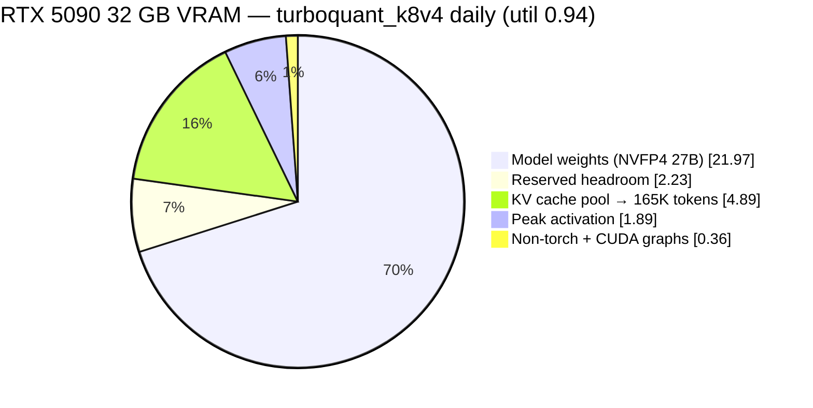

# Qwen3.6-27B on a single RTX 5090 — 165K KV pool, 8-bit-K/4-bit-V cache, speculative decoding

Serving **Qwen3.6-27B with a 165K-token KV pool (160K usable context), MTP speculative decoding, and vision** on one 32 GB consumer GPU (RTX 5090, Blackwell `sm_120`).

## What you get

- **Qwen3.6-27B** (Unsloth NVFP4, 4-bit weights) served over an OpenAI-compatible endpoint.
- **165K-token KV pool → 160K usable context** via `turboquant_k8v4` KV cache (8-bit Keys / 4-bit Values).
- **MTP speculative decoding** — draft head inside the weights, ~0 VRAM, mean acceptance length ~3.2.
- **Vision** — the model's image tower, on.
- All of it on **one 32 GB RTX 5090** (`sm_120`), memory-OC'd, 600 W.

```
                  max-len   decode c1   decode c4   decode c8   prefill @4K   KV density
turboquant_k8v4   160K       164 t/s     524 t/s     516 t/s     10,392 t/s   33.8K tok/GiB  ← daily
fp8_e4m3          131K       130 t/s     482 t/s     478 t/s      9,604 t/s   26.0K tok/GiB  ← alt: deep-ctx batch
```
*Decode is @512 tg-throughput mean (pure decode). `turboquant_k8v4` (8-bit Keys / 4-bit Values) wins single-stream and short-context at every concurrency; the one regime fp8 wins is **deep context (≥4K) at high concurrency** — see [Benchmarks](#benchmarks). Context shown is usable `--max-model-len`, not raw KV-pool size: the 165,274-token pool @ util 0.94 caps at max-len 160K because TurboQuant's continuation-prefill dequantizes the whole cached prefix to bf16 (~4 KB/token transient), so a single prompt far past the cap **OOM-kills the engine** — pool headroom buys concurrency, not longer prompts. fp8 fits 136,477 tokens; we cap it at 131K. See [CONFIG.md](docs/CONFIG.md).*

## Why it needs patches

This configuration **does not work on stock vLLM**. TurboQuant KV cache and MTP speculative decoding produce garbage output together — a known, unfixed upstream bug ([vllm#40880](https://github.com/vllm-project/vllm/issues/40880), tracked as unsupported in [#40069](https://github.com/vllm-project/vllm/issues/40069)). The open PR that claims to fix it ([#40914](https://github.com/vllm-project/vllm/pull/40914)) **does not work on Blackwell** — it has a bug of its own ([the full story](docs/HISTORY.md#the-bug-nobody-caught)). This repo's image carries #40914 plus the three fixes that make it actually work on `sm_120`, and the benchmarks proving it does. How the config was arrived at — including the "TurboQuant corrupts" misdiagnosis we later reversed — is in [docs/HISTORY.md](docs/HISTORY.md).

## Quick start

```bash
# 1a. pull the prebuilt image…
docker pull ghcr.io/adrienbrault/vllm-turboquant:2026-07-13

# 1b. …or build it yourself (~1 min — pure-Python patches, no CUDA recompile)
cd patches && docker build -t vllm-turboquant:patched .

# 2. serve
./scripts/serve.sh
```

The `:2026-07-13` tag is the **exact image behind every benchmark number in this repo** — the
patches target a moving `vllm-openai:nightly`, so the pinned digest is the reproducible path
(`:patched` floats with rebuilds). It's ~28 GB; that's the vLLM base, [not the patches](#whats-in-the-patch-stack).

Then `http://localhost:8020/v1` speaks OpenAI. See [`docs/CONFIG.md`](docs/CONFIG.md) for every flag and why.

> **Want the most battle-tested path, or serving deep-context high-concurrency batches?** fp8 KV on stock nightly remains a documented alternative — see [the status note](docs/HISTORY.md#status-turboquant_k8v4-is-the-daily) and the [alternative fp8 config](docs/CONFIG.md#alternative-stock-nightly--fp8-kv). Everything from here down is the TurboQuant path the daily runs.

## What's in the patch stack

| patch | what it does |
|---|---|
| [`vllm-only.diff`](patches/vllm-only.diff) | Upstream [PR #40914](https://github.com/vllm-project/vllm/pull/40914) (open, unmerged): routes K+1 spec-verify batches through the TurboQuant decode kernel instead of the continuation-prefill path, which was attending only to just-drafted tokens and ignoring cached KV. |
| [`fix_spec_output.py`](patches/fix_spec_output.py) | **The fix that makes #40914 actually work on Blackwell.** Honors the out-param contract ([details](docs/HISTORY.md#the-bug-nobody-caught)). Without this you get `!!!!!!!`. |
| [`tq_auto_fallback.py`](patches/tq_auto_fallback.py) | Second upstream gap: the MTP draft runner never inherits `cache_config.cache_dtype`, so TurboQuant layers on the draft path arrive with `"auto"` and crash. Falls back to `$VLLM_TQ_PRESET`. |
| [`fix_spec_guard.py`](patches/fix_spec_guard.py) | **Third fix — intermittent `!!!!` under concurrency.** #40914's routing guard (`query_start_loc.shape[0] == B + 1`) fails on CUDA-graph **captured** steps because qsl is padded to max batch size ([flagged by @rmarnold on the PR](https://github.com/vllm-project/vllm/pull/40914)) → silent fallback to the buggy path → stale output with **0% draft acceptance**, but only on padded concurrent batch shapes — single-stream lands on exact capture sizes and works, so every simple validation passes while real multi-agent sessions corrupt. Fix: `>=` (B derives from padding-free `num_actual_tokens`; padded tail rows are discarded by the caller). Repro: 3 concurrent ~48K-token streams. |
| [`tq_splits.py`](patches/tq_splits.py) | Makes TurboQuant's fixed decode KV-split count runtime-tunable (`$VLLM_TQ_KV_SPLITS`). *Tested: leave it at the default 32 — lowering it hurts both single-stream and batched.* |

## Benchmarks

Hardware: RTX 5090 32 GB (`sm_120`, +4500 MHz mem OC, 600 W) + Ryzen 9 5900X + 64 GB RAM, Ubuntu 24.04.
Model: [`unsloth/Qwen3.6-27B-NVFP4`](https://huggingface.co/unsloth/Qwen3.6-27B-NVFP4) (4-bit weights) + MTP `ns=3` + vision.
Tool: [llama-benchy](https://github.com/eugr/llama-benchy) 0.3.8. Both configs, identical invocation (`--pp 512 4096 --tg 128 --concurrency 1 2 4 8 --runs 3`), same box, same session (2026-07-15). Full detail in [bench/RESULTS.md](bench/RESULTS.md).

### Throughput — decode (tokens/s)

**Short context (`pp=512`, pure decode) — tg-throughput mean:**

| KV cache | c1 | c2 | c4 | c8 |
|---|---|---|---|---|
| fp8_e4m3 | 130 | 251 | 482 | 478 |
| **turboquant_k8v4** | **164** | **319** | **524** | **516** |

k8v4 wins at every concurrency (**+26% c1**). Peak-throughput c8 is **fp8 832 / k8v4 872** — k8v4 does *not* suffer the `turboquant_4bit_nc`-style c8 collapse, because 8-bit keys use the efficient attention path.

**Deep context (`pp=4096`, prefill mixed in) — tg-throughput mean:**

| KV cache | c1 | c2 | c4 | c8 |
|---|---|---|---|---|
| fp8_e4m3 | 137 | **259** | **461** | **292** |
| turboquant_k8v4 | **145** | 236 | 277 | 222 |

This is the **one regime fp8 wins**: deep context (≥4K) at high concurrency. TurboQuant's Triton value-dequant is ALU work that scales with attended context length, so at c4/c8 @4096 it falls behind fp8's hardware fp8 path (decode c4@4096: fp8 461 vs k8v4 277).

**Prefill (`pp`, c1):** @512 fp8 4,701 / k8v4 4,258 t/s; @4096 fp8 9,604 / **k8v4 10,392** t/s (k8v4 slightly faster at depth).
**Latency:** median inter-token fp8 1.15 ms / k8v4 1.22 ms; TTFT (c1@512) fp8 110 ms / k8v4 122 ms.
**MTP:** mean acceptance length ~3.2 of `ns=3` — fp8 and k8v4 statistically identical.

**Net for the daily** (interactive coding = low concurrency, deep context): k8v4 is faster single-stream, **+21% pool**, equal retrieval quality, equal MTP. fp8 remains the pick only for deep-context high-concurrency batch serving.

### VRAM budget

Weights eat ~70% of the card; only ~5 GiB is left for KV — and density is why the k8v4 daily fits **more** context into **less** of it:



fp8's KV slice is **bigger** (5.25 GiB) yet holds **fewer** tokens (136,477 vs 165,274) — 8-bit Keys + 4-bit Values ≈ 6 bits/element vs fp8's 8, so k8v4 is denser where it counts. Full breakdown (util 0.94, 31.34 GiB usable):

| component | turboquant_k8v4 | fp8_e4m3 |
|---|---|---|
| Model weights (NVFP4 27B) | 21.97 GiB | 21.97 GiB |
| Peak activation | 1.89 GiB | 1.89 GiB |
| Non-torch + CUDA graphs | ~0.36 GiB | ~0.36 GiB |
| **KV cache pool** | **4.89 GiB → 165,274 tok** | 5.25 GiB → 136,477 tok |
| Reserved headroom | ~2.23 GiB | ~1.9 GiB |
| **KV density** | **33.8K tok/GiB** | 26.0K tok/GiB |

k8v4's unified block size is 2,112 (fp8's is 1,600); it adds 3 padding layers (up to 6.25% KV waste) for mamba-page parity, and still lands +21% ahead on pool.

### Quality

| eval | score | notes |
|---|---|---|
| **Aider polyglot** (225 exercises, diff) | **72.3%** pass@2 | 97.3% well-formed edits — reliably emits machine-applicable diffs |
| **Terminal-Bench 2.1** (8-task subset ×2) | **7/8** pass@2 | matches the fp8 baseline — the KV cache costs no measurable quality |
| **[tool-eval-bench](https://github.com/SeraphimSerapis/tool-eval-bench) v2.1.0** (84 scenarios, hardmode, 4 trials) | **89.0 ± 0.0** /100 | Hard Mode 80%; deterministic across trials. On the v2.0.6 protocol: **90.0** vs [published](https://github.com/MiaAI-Lab/Unsloth-Qwen3.6-27B-UD-Q8_K_XL_vs_nvidia-Qwen3.6-27B-NVFP4_tools_eval) nvidia NVFP4 **89** / Unsloth Q8 **83** — details in [bench/RESULTS.md](bench/RESULTS.md) |

MTP mean acceptance length ~3.2 of `ns=3` (identical fp8/k8v4). Needle-in-haystack retrieval, `turboquant_k8v4`: **8/8 @9K, 8/8 @20K, 6/6 @40K** — matches fp8 and fixes the 0/8 that `turboquant_4bit_nc`'s 4-bit keys scored (see [history](docs/HISTORY.md#status-turboquant_k8v4-is-the-daily)).

## Config essentials

`./scripts/serve.sh` runs the daily. The load-bearing flags, all explained in [`docs/CONFIG.md`](docs/CONFIG.md):

- `--kv-cache-dtype turboquant_k8v4` + `-e VLLM_TQ_PRESET=turboquant_k8v4` (must match) — the 8-bit-K/4-bit-V cache; needs the patched image.
- `--gpu-memory-utilization 0.94 --max-model-len 160000` — let vLLM profile the 165K pool; don't hand-set `--kv-cache-memory`, don't hand-set `--block-size` (auto-resolves to 2112).
- `--speculative-config '{"method":"qwen3_5_mtp","num_speculative_tokens":3}'` — MTP, `ns=3`.
- `--mamba-cache-mode align --enable-prefix-caching --enable-chunked-prefill` — hybrid-model prefix caching.
- `--reasoning-parser qwen3 --enable-auto-tool-choice --tool-call-parser qwen3_xml` — `qwen3_xml` is correct; `hermes` silently drops tool calls.
- `--limit-mm-per-prompt '{"image":4,"video":0}'` — vision on (~60K tokens of context).

Model: pass Unsloth's `unsloth/Qwen3.6-27B-NVFP4` with **no** `--quantization` flag (it's compressed-tensors, auto-detected). The box runs a **+4500 MHz memory-only OC** at 600 W — all throughput numbers assume it; see [docs/CONFIG.md#host-notes](docs/CONFIG.md#host-notes).

## Alternative: LMCache tiered KV cache for multi-agent coding

**Multi-agent coding lives and dies by cache retention, not single-stream throughput.** Eight coding agents sharing one endpoint re-send enormous, near-identical prefixes (system prompt, tool schemas, repo context, growing session history). vLLM's on-GPU prefix cache evicts them the moment the pool fills; a revisit then pays a full **5.8s re-prefill** on a 40K-token session. So we gave vLLM a tiered KV cache via [LMCache](https://github.com/LMCache/LMCache): a **24 GB pinned-RAM L1** + **150 GB SSD L2** that survives eviction *and* container restarts.

**It works, and it composes with MTP speculative decoding** — the combination the upstream trackers list as unsupported ([vLLM #39809](https://github.com/vllm-project/vllm/issues/39809), [#26201](https://github.com/vllm-project/vllm/issues/26201) "mamba prefix caching + spec decode: TODO", [LMCache #2845](https://github.com/LMCache/LMCache/issues/2845)). The composed profile decodes within **−3..−9%** of the plain MTP daily and turns a cold-session revisit from 5.8s into **sub-1.4s**:

| decode t/s | c1 | c2 | c4 | c8 |
|---|---|---|---|---|
| daily — MTP, no cache | 126 | 247 | 449 | **488** |
| MTP + LMCache — composed on vLLM 0.24 (no patch) | 118 | 224 | 421 | 450 |
| MTP + LMCache — nightly + [our format-10 patch](patches/README.md#lmcache-format-10-kernel-patch-separate-project) | 122 | 240 | 428 | **458** |

The tiered-hit ladder (40K-token sessions): on-GPU ≈ instant → **L1 RAM hit ~0.5s** → **L2 SSD hit ~2.7s** → **cold re-prefill 5.8s**. Composed revisit walls land **0.64–1.4s** across the tiers. 150 GB of L2 is **~2M tokens of session history that never re-prefills and persists across restarts** — a 10×40K working set (29 GB > the 24 GB L1) spills to SSD with **zero thrash**, all 32 post-warm lookups hit. Prefill holds up too — composed sweep (batched 3199): **9.1K @2K / 9.0K @8K / 8.2K @16K / 7.0K @32K / 5.5K @64K / 4.0K @115K** t/s, ≈−10% vs the daily's batched-8192 path at matched depth. Pool: 124K tokens composed (nightly + patch), 163K no-MTP.

- **LMCache (MTP, no vision)** is the recommended setup for **multi-agent coding** — the profile runs `image:0`, trading vision for cache retention that pays for itself the moment two agents share a prefix. It uses **fp8 KV**: LMCache's persistence tier only round-trips faithfully with fp8 (the k8v4 attempt is a documented non-ship — [details](docs/LMCACHE.md#lmcache--k8v4-composes-but-the-persisted-tier-is-lossy--not-shipped)).
- **The `turboquant_k8v4` daily** stays the **vision-capable** pick for a single interactive user, where there's no shared prefix to retain and single-stream latency is what you feel — and it's now *faster* single-stream than fp8.

**Serve it:** [`scripts/serve-lmcache.sh`](scripts/serve-lmcache.sh) (port 8030). Every flag, the failure that earned it, and the LMCache-specific gotchas (flashinfer JIT, `expandable_segments`, the worker reaper, L1 sizing, the format-10 kernel patch) are in [`docs/LMCACHE.md`](docs/LMCACHE.md).

## Gotchas that bite during setup

1. **flashinfer JIT eats all host RAM (non-nightly images).** Any non-nightly vLLM image on `sm_120` **JIT-compiles the CUTLASS fp4 GEMM on the first forward pass** with unbounded `nvcc` parallelism — multi-GB per job, reads as a mystery "hang" (GPU idle while nvcc grinds) or a whole-host livelock. Cap it: `MAX_JOBS=4` + `FLASHINFER_NUM_COMPILE_JOBS=4`, and **mount a persistent `/root/.cache/flashinfer`** (one ~30-min build, warm forever). The nightly image ships these kernels prebuilt and never shows this.
2. **vLLM's prefix-cache metric lies on this model.** `vllm:prefix_cache_hits_total` and the "Prefix cache hit rate: 0.0%" log line report **0% while the cache is working**. Verified by timing: repeated 9,827-token prompt → **1.16s cold, 0.23s warm (5×)**. Don't debug the counter — time a repeated prompt ([`bench/prefix_probe.py`](bench/prefix_probe.py)).
3. **Always validate coherence via raw `/v1/completions`.** The chat endpoint's reasoning parser swallows degenerate output as *empty content*, so a broken model looks "fine but quiet". Degeneration tells: constant-token output, or **flat 100% MTP acceptance** (means draft and verify are locked in step).
4. **Re-verify after every vLLM bump.** These patches are version-sensitive; a nightly that moves `turboquant_attn.py` will silently fail to apply or, worse, apply to shifted code.
5. **`--kv-cache-memory` "fully utilize" hint OOMs at 240K+** — it ignores warmup transients. Use `--gpu-memory-utilization` and let vLLM profile.
6. **util 0.95 crashes under concurrent cold starts.** A burst of ~8 simultaneous fresh prompts OOMs the GDN prefill kernel (~96 MiB transient) and **kills the engine** — `expandable_segments` doesn't save it, and a ramping benchmark (llama-benchy) never trips it, so you find out in production. Run **0.94**, burst-verified.
7. **TurboQuant's real single-prompt ceiling is below the KV pool size.** `_continuation_prefill` dequantizes the *entire cached prefix* to bf16 (~4 KB/token transient) — a single prompt far past the cap allocates hundreds of MB of scratch that isn't there and **OOM-kills the engine** mid-prefill. Cap `--max-model-len 160000` against the 165,274-token pool. The pool above the cap serves concurrency, and note each active sequence also pins a fixed GDN/Mamba state (~13% of pool), so 8 concurrent seqs ≈ pool-full regardless of prompt length.
8. **Validate under *concurrency*, not just single-stream.** The guard bug (patch 4) passes every single-stream test — needle, benchmarks, tool evals — and corrupts only on padded concurrent batch shapes. If we'd load-tested with 3 parallel long-context streams on day one, it would have cost an hour instead of a production incident.

## How we got here / what didn't work

- **[docs/HISTORY.md](docs/HISTORY.md)** — how the config was arrived at. For weeks we shipped fp8 and treated the TurboQuant image as "corrupting"; a ~30-round investigation traced the `!!!!` to a noisy soak-test detector plus 4-bit-*key* quality loss, not a bug. Includes [the one real bug](docs/HISTORY.md#the-bug-nobody-caught) — a discarded out-param under CUDA-graph capture — that the patch stack genuinely fixes.
- **[docs/REJECTED.md](docs/REJECTED.md)** — everything tried and rejected, with the number that killed it: `turboquant_4bit_nc` (0/8 retrieval), nvfp4-native (won't load), DFlash, the official NVIDIA quant, `--async-scheduling`, `VLLM_TQ_KV_SPLITS`, the froggeric template, and LMCache+k8v4. Read it before "improving" the config. Benchmark-only rejects with their deltas are in [bench/RESULTS.md](bench/RESULTS.md#rejected-with-numbers-so-nobody-redoes-them).

## License

MIT (see [LICENSE](LICENSE)) for the original work here — docs, benchmarks, scripts, and the fixes.

`patches/vllm-only.diff` is redistributed verbatim from [vllm#40914](https://github.com/vllm-project/vllm/pull/40914)
by @Sandermage and stays under **Apache-2.0**, as do the vLLM files the patches modify. See
[THIRD_PARTY.md](THIRD_PARTY.md).

## Credits

- [vLLM](https://github.com/vllm-project/vllm) and PR [#40914](https://github.com/vllm-project/vllm/pull/40914) by @Sandermage — the foundation this builds on.
- [Unsloth](https://huggingface.co/unsloth) for the NVFP4 quant that beat every alternative tested.
- [llama-benchy](https://github.com/eugr/llama-benchy), [Terminal-Bench / Harbor](https://www.tbench.ai/), [aider](https://github.com/Aider-AI/aider) for the measurements.
